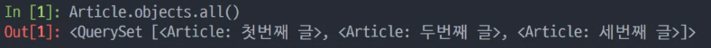
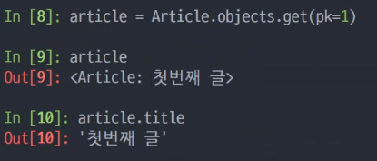

## 모델링을 한 뒤 수행하는 루틴


> 시작 파이썬 언어로 DB 모델링

1. models.py에서 모델을 추가, 수정, 삭제

2. makemigrations : 설계도를 생성 (0001_initial)

3. migrate : 설계도를 실제 DB에 반영

   

> 끝 : DB 반영 완료


수정했으면 해야하는 루틴이다.


* showmigrations 하면 설계 반영되어있는지 리스트 뽑아준다.


2번 과정에서 나올수 있는 메시지 ( date time 관련)

```
You are trying to add the field 'created_at' with 'auto_now_add=True' to article without a default; the database needs something to populate existing rows.

 1) Provide a one-off default now (will be set on all existing rows)
 2) Quit, and let me add a default in models.py
Select an option:

1 (일회성)

Please enter the default value now, as valid Python
You can accept the default 'timezone.now' by pressing 'Enter' or you can provide another value.
The datetime and django.utils.timezone modules are available, so you can do e.g. timezone.now
Type 'exit' to exit this prompt
[default: timezone.now] >>>

(그냥 엔터누름 - 현재시간으로)

```


## RDB

RDB 관리하는 시스템이 여러가지 존재 - 우리는 SQL 쓴다.


Django 가 쓰고 있는것은 sqlite, 경량 rdbms  그래서 실제 프젝에선 x


## 설치


```
pip install ipython django-extensions
```

하고

settings.py 에

`'django_extensions'` 등록

등록할때 순서맞추기 로컬- 익스텐션- 코어 순서


``` 
python manage.py shell_plus
```


```
Article
```


클래스이름(모델).objects.쿼리셋API

```
Article.objects.all()
```


모델 인스턴스 만들기

```
article = Article()
```


저장하기 전 

```
article
```


```
article.title = '첫번째 글'
```


```
article.content = '첫번째 내용'
```


```
article.title
```


```
Article.objects.all()
```

만들었는데 확인해도 없네...


```
article.save()
```

자동으로 생기는 것으로 저장하게 해준다.


```
Article.objects.all()
```

하면 데이터 들어옴, PK값 하나 유지해준다.


```
article
```

하면 달라져있다. 오브젝트가 생겼다는 것을 볼 수 있다.


밑에 두개를 확인해보자

```	
article.created_at
```


```
article.updated_at
```


## 오후수업

2번째 방법? 

```bash
article = Article(title='두번째 글', content='두번째 내용')
```


또 방법?


```bash
Article.objects.create(title='세번째 글', content='세번째 내용')
```


기존의 이런 화면을 


다음과 같은 함수를 models.py에 넣어주고 다시 실행시키면 보기 좋게 바뀐다.

```python
def __str(self):
    return self.title
```




READ


* all()  : 모든 데이터 가져오기 (QuerySet 형태)
* get() : 유일한 값을 가지는 필드를 기준으로 데이터를  조회 (PK) (인스턴스 '하나'를 가져오기 위한 api)
* filter() : 중복 가능성이 있는 필드를 기준으로 데이터 조회 (QuerySet 형태)




```bash
db에서 바꿀려면 save를 해줘야한다.
```

crud


* delete 하는것

```bash
article.delete()
```

db에는 삭제됨 그러나 원래 있던 데이터는 그대로


```bash
article.pk
```

출력하면 아무것도 안뜸


**orm 을 통해서 python class 인스턴스 객체를 조작할 수 있다.**


## 관리자 계정 만들기


```bash
python manage.py createsuperuser
```

해서 admin 사용자 1234 해서 만들어놓음


```python
from .models import Article

# Register your models here.
admin.site.register(Article)
```


## CRUD

1. url 분리

   * ```python
     
     ```

   * 

2.  views 함수 만들기

3. templates/articels 에 index 만들기

4. 프로젝트 폴더에 templates 만들고 setting 해주기

5. ```
   'DIRS': [BASE_DIR / 'samplepjt' / 'templates'],
   ```

6.  위에 원하는 순서대로 들리도록 지정해주기 

7. base.html 만들기

8.  index.html 에 상속해주기 

9. http://127.0.0.1:8000/articles/ 들어가서 확인

10. views에 들어가서 article 자료 들고오기

11. index.html 에 들어가서 반복문 해서 가져오기 

12. 사용자 페이지에서 직접 입력할수 있게 해주기

13. url 에 새로운곳으로 갈수 있는것 만들어주기

14. views 들어가서 해당 내용 받을 수 있는 함수 만들어주기

15. new.html 파일 templates/articles에다가 만들어주

16. new.html 파일에 들어가서 상속 받아주고 

    * input의 name 속성은 key값이다.
    * action 은 주소
    * method 는 어떤형태로 가는것 디폴트값은 GET( 인터넷 창에 주소 치는것과 똑같음 )

17. urls.py 가서 create라는 새로운것 생성

18. view에서 create 생성

19. create.html 위에 넣어던 경로와 같은 경로에다가 생성

    * 참고) 액션 주소 잡아주기

20. 최신글을 위로 올려주기위해서 views index 함수에 해주기

21. 게시글이 작성되었다는 확인 글 없애려면 views 에서 create.html 이 아닌 index.html 로 바꿔주면 잘 보면 주소가 다름 왜냐하면 create로 들어왔기 때문에 주소에 create가 남음 create에서는 아무것도 안넘겨줘서 없음

    * articles/create/title? 순서로 나옴
    * 

22. | GET                                                     | POST                                          |
    | ------------------------------------------------------- | --------------------------------------------- |
    | 가져오다                                                | 작성하다(게시하다)                            |
    | DB의 상태는 바꾸지 않음                                 | DB의 상태를 바꾼다.<br/>(글 생성, 수정, 삭제) |
    | 필요한 데이터는 URL에 담는다.<br/>(쿼리스트링/파라미터) | 필요한 데이터는 HTTP Body에 담는다.           |

23. GET 요청을 POST 요청으로 바꿔준다 view랑 new에 

24. POST사용할때 항상 넣어야 하는 CSRF 토큰을 넣으면 value값에 해쉬 값이 들어온다.

25. ```python
    return redirect('articles:index')
    ```

    과정을 통해 페이지를 바꿔준다.

26. 

