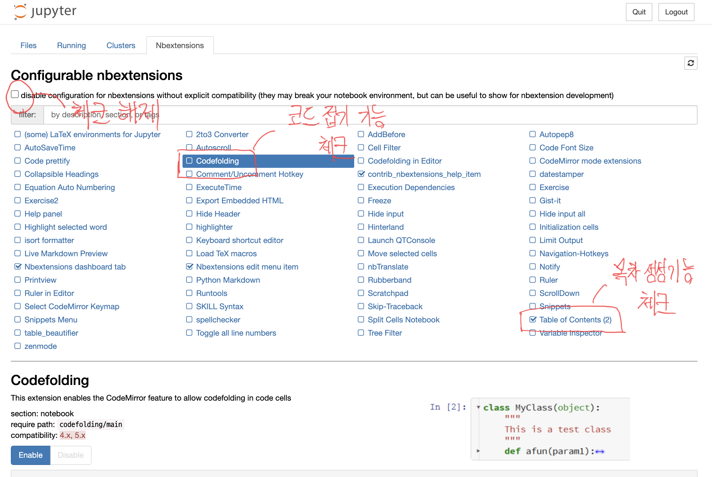
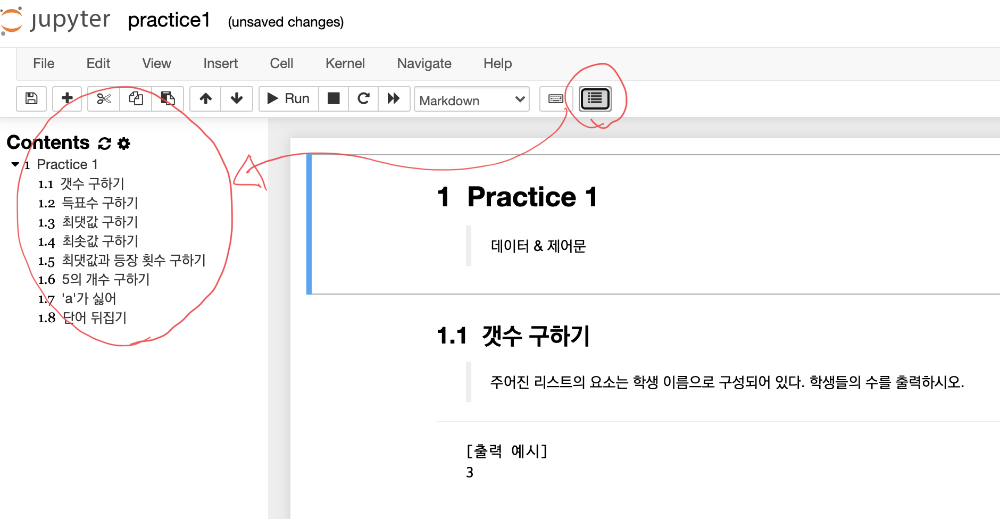

### 주피터 노트북 & 확장 프로그램 삭제

* Git Bash 명령어 실행

  ```bash
  $ jupyter contrib nbextension uninstall --user
  $ pip uninstall jupyter_contrib_nbextensions
  $ pip uninstall notebook
  ```

* `.jupyter` 폴더 삭제
  * [jupyter 폴더 위치 찾기](https://ooyoung.tistory.com/7#:~:text=%EC%B2%98%EC%9D%8C%20%EC%A3%BC%ED%94%BC%ED%84%B0%20%EB%85%B8%ED%8A%B8%EB%B6%81%EC%9D%84%20%EC%8B%A4%ED%96%89,%EC%9D%B4%EB%A6%84%20%5D%EC%9C%BC%EB%A1%9C%20%EC%84%A4%EC%A0%95%EB%90%98%EC%96%B4%EC%9E%88%EB%8B%A4.)


### 주피터 노트북 & 확장 프로그램 설치

* Git Bash 명령어 실행

  ```bash
  $ pip install notebook
  $ pip install jupyter_contrib_nbextensions
  $ jupyter contrib nbextension install —user
  ```


### 주피터 노트북 실행 & 환경 설정

```bash
$ jupyter notebook
```







