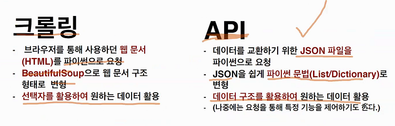
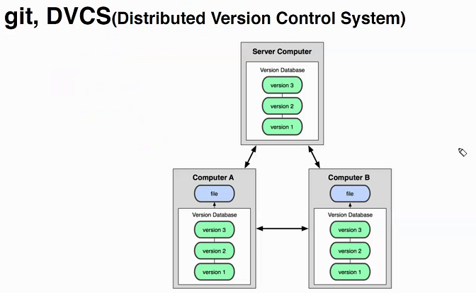
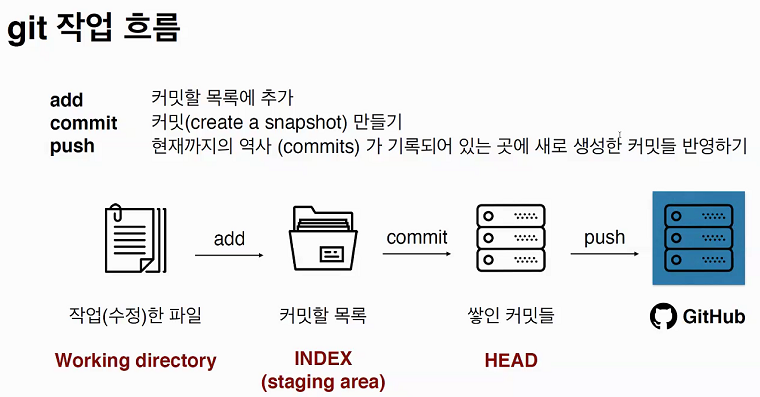
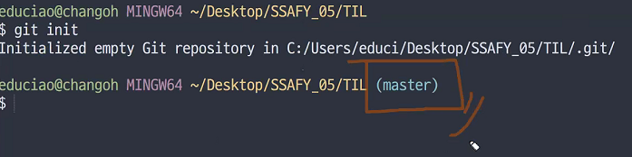
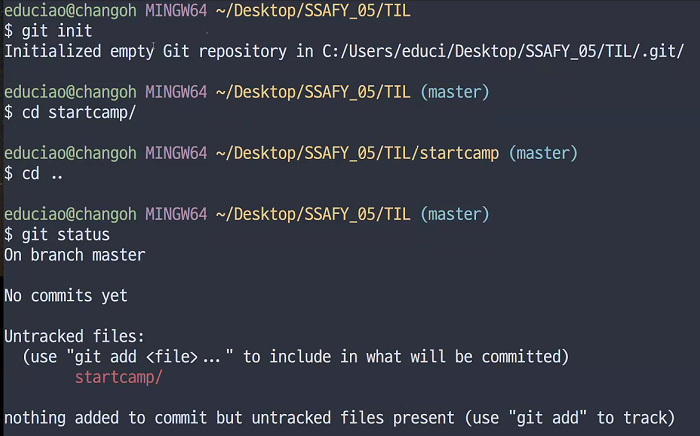
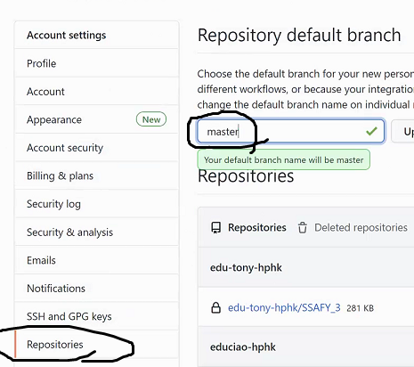
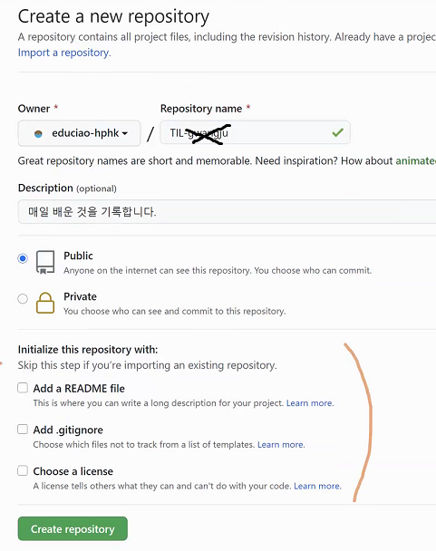
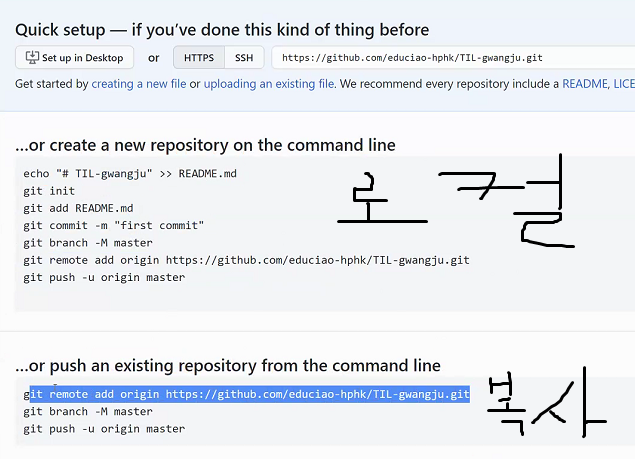

# 1월 15일 수업

## data

공공 데이터 활용시에는 설명서? 를 잘 읽어야 한다.

각각 자신의 인증키를 활용하여 사용해야한다.

이것을 요청변수에 맞춰 값을 채워넣는다.

 

## 2. Git !!!!!!!!!!

### 깃이란?

**(분산) 버전 관리 시스템** : 코드의 History를 관리하는 도구. 개발된 과정과 역사를 볼 수 있으며, 프로젝트 이전 버전을 복원하고 변경사항을 비교, 분석 및 병합도 가능

> 깃의 구조

* 깃이 있다면 파일들의 차이점을 알수 있고 수정과정을 남길 수 있다.

* 커밋 : 버전을 만드는 것이라고 생각
* 푸시 : 커밋들을 업로드

일반파일을 구글드라이브 드롭박스 등을 이용하는 것 처럼  git 이 관리한 코드로 깃랩, 깃헙 등을 이용

---

### 깃허브 등록 순서 (나의 메모)

`git add . `하면 해당경로의 모든 파일들을 목록에 추가해줌 (커밋을 만들기위한 파일 추가-커밋준비끝)

`git add 파일이름`하면  파일 추가됨

`git commit -m` "해당 커밋에 대한 메세지"   (메세지 반드시 존재해야함)

`git push 명칭 master` 하면 온라인에 업로드 됨(최신으로 업로드)

**항상 add - commit - push 순서고 커밋수정될 때 마다 m 남겨주기**

---

`git status` 깃의 상태와 새로운 파일과 수정여부에 대한 탐지?

`git log` 커밋 버전의 역사 - 작성자 정보

로컬에서 생성한 것 로컬 레포

깃헙에서 생성한것 리모트 레포

`git remote` 리모트 이름

`git remote -v`  연결 된 것들 주소 나옴 

깃랩 등록 관련해서 다시 적을 예정

참고  초기 등록시에는 로그인이 필요하다  

만일 로그인이 틀렸을 시에는 윈도우 자격증명관리자를통해 지우면 된다.

깃허브 사이트에서 등록하면 여러사람이 작업할때 충돌이 발생할 가능 성이 있기 때문에 

로컬에서 작업한 것을 올려서 하는것 

깃 메인 폴더에 숨김항목으로 .git 이 들어가 있으면서 관리함

but 다른 컴퓨터에서 압축파일로 다운받으면 .git이 없음 

방법)

**.git 까지 한번에 복사해올라면  git clone URL주소 해와야함** (최초에만 해야함)

그이후 최신화 정보를 받아올때는 pull 

`git pull 이름 master` 

**하나의 프로젝트에는 하나의 폴더? 만 **

* 하위 폴더에서 새로운 프로젝트 생성 x

**깃 올릴때 무지무지 중요한것 개인 Token, ID 코드내에 있는지 꼭 확인하고 올리지말자**

참고로 https://hpy.hk/gwangju2  스프레드 시트

