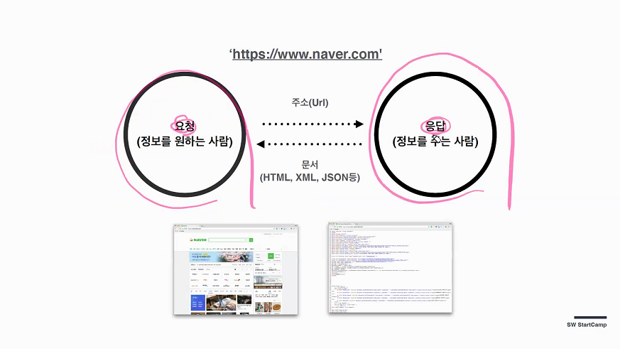
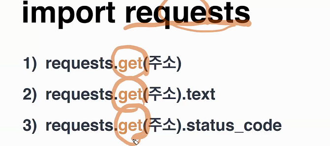
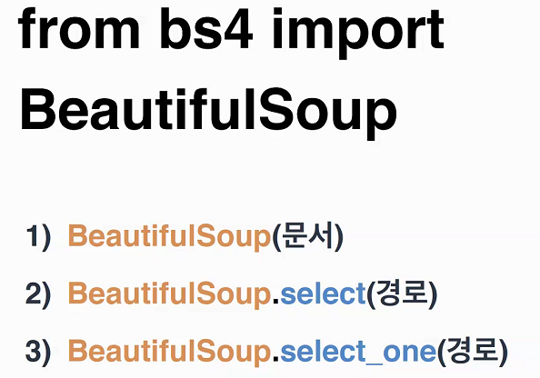

# 1월 14일 강의메모

마크다운의 파일에 첨부된 이미지는 외부에서 불러오는 것 이기 때문에 마크다운 단독으로 파일을 첨부하면 힘들다

그냥 끌어다 놓으면 임의로 생성된 폴더내에 복사본이 생기고

아닐시에는 그 경로 따라서 간다

참고: 코드 보기는 컨트롤 +/

타이포라 테마를 이용해서 테마를 바꿀 수 있다.

[챗봇 수정](py.hphk.io) 

[설치 가이드](https://www.notion.so/ff144edf41044fb789ea4c3e7b478fe8?v=38e1799d52724a269df8b4252e7684a3) 

## vscode 관련

`ctrl + shift + P` 팔레트로 테마 바꿀 수 있음

`ctrl + b` 편집기 껐다 키기

  

리스트나 딕셔너리에 맨마지막 요소가 없어도 , 붙이는것 -> trailing comma

why? 처음에 리스트를 선언했을때 그 값이 그대로 가는 것이 아니라 급하게 추가해야 하는 경우

미리 붙여놓는 것 

bash 출력 python 파일이름.py 

팔레트 들어가서 shortcut 검색 run in python 으로 하면 위에 재생버튼 단축키 생성 가능

## 웹크롤링

### 1. HTML 형태

 

https://search.naver.com/search.naver

?

query=SSAFY

이렇게 이루어짐 나머지는 사용자에 따라 붙은 것 

=>크롬창이 주소에 대한 요청을 보내고 그 응답 결과를 웹 화면으로 보여준다.

이 요청 주체를 파이썬이 하게끔 바꾸는것

아무장소에서 git bash here 해서 pip install requests 하면 됨

주소를 뽑거나 글자만 뽑거나 상태코드만 뽑거나 

### 2. API (JSON)

JSON 데이터만을 주고 받기 위한 표기법 (Java Script Object Notation)

[나이예측](agify.io)

## 알아봐야 할것

* bash 터미널 실행 명령어
* 맨처음 했던 네개 코드 분석
* 노션 알아보기

