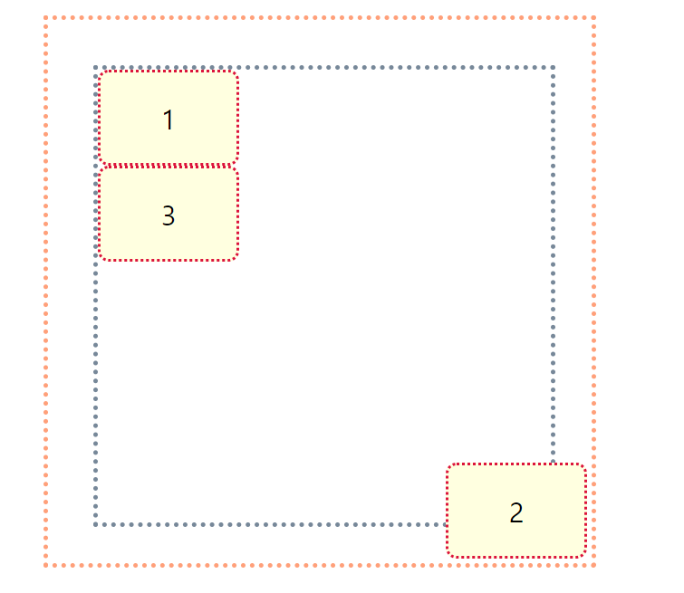
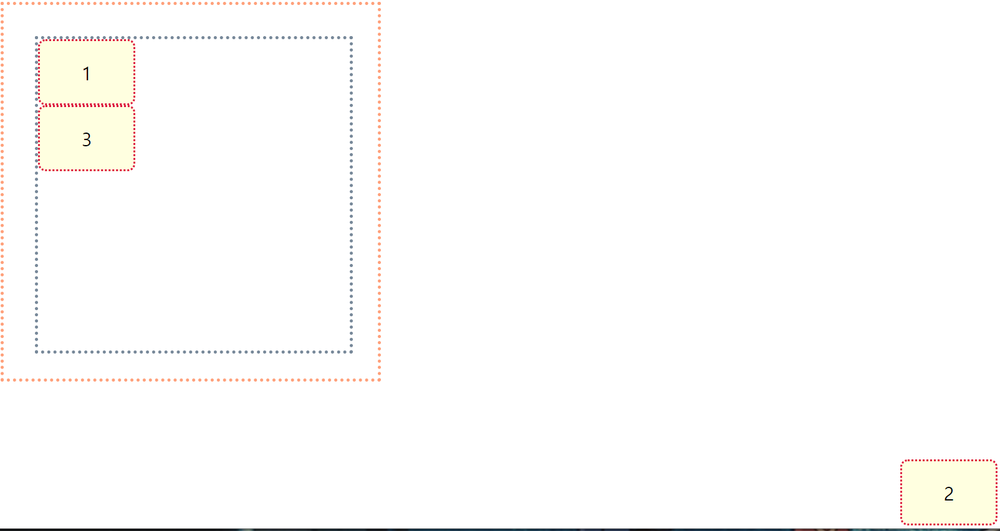

# CSS Position

> CSS Position 요약 (for 광주 2반)

* `position` 속성을 통해 **문서 상에 요소를 배치하는 방법**을 지정한다.

* `top`, `right`, `bottom`, `left` 속성을 통해 **요소의 최종 위치**를 결정한다.

* 사용법은 간단하다.
  1. 기준을 잡는다.  (예- `position: relative;`)
  2. 이동시킨다. (예- `top: 50px;`)


---


## Position 속성

> 요소를 옮기려면 일단 위치를 옮길 기준점을 잡는다.

| 값       | 의미                             |
| -------- | -------------------------------- |
| static   | 기준 없음 (배치 불가능 / 기본값) |
| relative | 요소 자기 자신을 기준으로 배치   |
| absolute | 부모(조상) 요소를 기준으로 배치  |
| fixed    | 뷰포트 기준으로 배치             |
| sticky   | 스크롤 위치를 기준으로 배치      |


---


## Top, Bottom, Left, Right 속성

> 기준점을 잡았으면 다음 네 가지 속성을 이용해서 요소의 위치를 옮길 수 있다.
>
> 요소의 Position 기준에 맞춰 위쪽, 아래쪽, 왼쪽, 오른쪽에서의 거리를 설정한다.

* top : 요소의 position 기준에 맞는 위쪽에서의 거리(위치)를 설정
* bottom : 요소의 position 기준에 맞는 아래쪽에서의 거리(위치)를 설정
* left : 요소의 position 기준에 맞는 왼쪽에서의 거리(위치)를 설정
* right : 요소의 position 기준에 맞는 오른쪽에서의 거리(위치)를 설정


---


## Relative

> 요소를 일반적인 문서 흐름에 따라 배치한다.
>
> **요소 자기 자신의 원래 위치(static 일 때의 위치)를 기준으로 배치**한다.
>
> - 원래 위치를 기준으로 위쪽(top), 아래쪽(bottom), 왼쪽(left), 오른쪽(right)에서 얼마만큼 떨어질 지 결정한다.
> - 위치를 이동하면서 다른 요소에 영향을 주지 않는다.
> - 문서 상 원래 위치가 그대로 유지된다.


```html
<div class="grand-parent">
  <div class="parent">
      <div class="child">1</div>
      <div class="child relative">2</div>
      <div class="child">3</div>
  </div>
</div>
```

```css
.grand-parent {
    /* 박스 스타일링 */
    width: 500px;
    height: 500px;
    border: 5px dotted lightsalmon;
    padding: 50px;
}

.parent {
    /* 박스 스타일링 */
    width: 500px;
    height: 500px;
    border: 5px dotted lightslategray;
}

.child {
    /* 박스 스타일링 */
    width: 150px;
    height: 100px;
    border: 3px dotted crimson;
    border-radius: 12px;
    background: lightyellow;

    /* 텍스트 정렬 */
    display: flex;
    justify-content: center;
    align-items: center;
    font-size: 30px;
}

.relative {
    position: relative;
    left: 100px;
    top: 80px;
}
```


---


## Absolute

> 요소를 일반적인 문서 흐름에서 제거한다.
>
> **가장 가까운 위치에 있는 조상 요소를 기준으로 배치**한다.
>
> - 조상 요소 위치를 기준으로 위쪽(top), 아래쪽(bottom), 왼쪽(left), 오른쪽(right)에서 얼마만큼 떨어질 지 결정한다.
> - 조상 중 Position을 가진 요소가 없다면 초기 컨테이닝 블록를 기준으로 삼는다. (static을 제외한 값)
> - 문서 상 원래 위치를 잃어버린다. (아래에 있는 div가 해당 자리를 차지한다)


### 부모 relative & 자식 absolute

> Parent에게 Position 값이 있는 경우, Parent의 위치를 기준점으로 삼는다.

```html
<div class="grand-parent">
  <div class="parent">
      <div class="child">1</div>
      <div class="child absolute">2</div>
      <div class="child">3</div>
  </div>
</div>
```

```css
.parent {
    /* ... */
    /* ... */

    position: relative;
}

.absolute {
    position: absolute;
    bottom: 5px;
    right: 5px;
}
```


### 조상 relative & 자식 absolute

> Grandparent에게 Position 값이 있는 경우, 한 단계 올라가서 Grandparent의 Position 값을 찾아서 기준점으로 삼는다.

```html
<div class="grand-parent">
  <div class="parent">
      <div class="child">1</div>
      <div class="child absolute">2</div>
      <div class="child">3</div>
  </div>
</div>
```

```css
.grand-parent {
    /* ... */
    /* ... */

    position: relative;
}

.absolute {
    position: absolute;
    bottom: 5px;
    right: 5px;
}
```





### 조상 Position 없음 & 자식 absolute

> 부모, 조상 전부 뒤져봐도 Position 값이 없는 경우(Parent, Grandparent, body 태그, html 태그까지), window 객체의 **뷰포트**를 **기준점**으로 삼는다.

```html
<div class="grand-parent">
  <div class="parent">
      <div class="child">1</div>
      <div class="child absolute">2</div>
      <div class="child">3</div>
  </div>
</div>
```

```css
.absolute {
    position: absolute;
    bottom: 5px;
    right: 5px;
}
```





---


* 하지만 위와 같은 방법으로 쓰면 x 태그가 많아지면 있는지 없는지 모르고 혼동이 온다.


## Fixed

> 뷰포트를 기준으로 삼고 싶은 경우, 명시적으로 fixed라고 표시한다.
>
> `absolute`를 사용해서 똑같이 구현할 수 있지만, `absolute`는 조상 요소의 위치를 기준점으로 삼는 개념이므로 뷰포트를 기준점으로 삼으려면 `fixed`를 사용한다.

* 요소를 일반적인 문서 흐름에서 제거한다. 페이지 레이아웃에 어떠한 공간도 배정하지 않는다.
* 뷰포트를 기준점으로 붙어있다(==화면에 붙어있다)
  * 쇼핑몰 우측 하단에 있는 '상단으로 바로가기'버튼


* 결과는 위와 같이 나오고 스크롤 내려도 그대로

```html
<div class="grand-parent">
  <div class="parent">
      <div class="child">1</div>
      <div class="child fixed">2</div>
      <div class="child">3</div>
  </div>
</div>
```

```css
 .fixed{
      position: fixed;
      bottom: 30px;
      right: 30px;
      
    }
```


